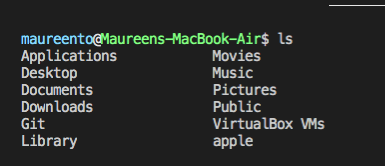

# Bash Customizations

My personal customizations for my bash settings. Check out my other dotfiles for specific configurations (e.g. env, pip_installs).

  Why customize your bash? Well, even something as simple as aliasing a `cd` [change directory] as `alias ..="cd ../"`, you can greatly increase your productivity and personalize your computer/development environment suited to your needs. For example, if you purchase a new OS, you'd probably forgotten what GUI apps you've installed, or what settings you've setfrom before. You might find yourself trying to download what you remember, and then downloading more if you forgot an app.
  Instead, if you have a customized set of dotfiles with various solutions, you can easily set up your new computer with the basic necessities you want.
  

## Installation

Create a new directory for this repo first, in case you ever want to reverse changes. Then, clone the repo:
`git clone <GitHub repo url> && source <choose a .sh file>`

These are my personalized dotfiles so do download if you love it! Feel free to `git clone <repo url>` the files to make your own customizations and take out what's not needed.

### Note
- Some developers argue not to fork dotfiles: https://www.anishathalye.com/2014/08/03/managing-your-dotfiles/

## License:
MIT

## Credits & Inspiration
- Corey M. Schafer for your amazing Youtube videos
- @mathiasbynens: https://github.com/mathiasbynens/dotfiles
- For a general coverage of bash customization, see Lars Kappert's Medium article: https://medium.com/@webprolific/getting-started-with-dotfiles-43c3602fd789
